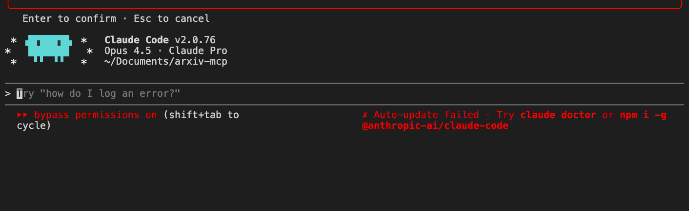

# arxiv-library-mcp

**MCP server for searching and managing arXiv papers with Claude and Cursor.**

A persistent, semantically searchable research library that lives locally. Import papers by arXiv ID, search with natural language, tag and annotate, track preprints to publication, detect duplicates, cluster by topic, and export BibTeX — all through conversational AI.

**Built for**: Researchers, grad students, and engineers who read arXiv papers and use Claude Code, Claude Desktop, or Cursor.

<p align="center">
  
</p>

## Install

```bash
# Requires Python 3.11+ and uv
curl -LsSf https://astral.sh/uv/install.sh | sh
source $HOME/.local/bin/env

git clone https://github.com/anjan-r-athreya/arXiv-mcp.git
cd arXiv-mcp
uv sync
```

### Register with Claude Code
```bash
claude mcp add arxiv-library -- uv run --directory $(pwd) python -m arxiv_library_mcp
```

### Register with Claude Desktop
Add to `~/Library/Application Support/Claude/claude_desktop_config.json` (macOS):
```json
{
  "mcpServers": {
    "arxiv-library": {
      "command": "uv",
      "args": ["run", "--directory", "/absolute/path/to/arXiv-mcp",
               "python", "-m", "arxiv_library_mcp"]
    }
  }
}
```

### Register with Cursor
Add to Cursor's MCP settings with the same command and args as above.

## What You Can Do

Once registered, just talk to Claude:

- *"Add paper 1706.03762 and tag it transformers"*
- *"Search my library for attention mechanisms"*
- *"Find papers similar to the BERT paper"*
- *"Export my NLP papers as BibTeX"*
- *"Cluster my library by topic"*
- *"Check if any preprints have been published"*

## Tools (15)

### Import
| Tool | What it does |
|---|---|
| `add_paper` | Add by arXiv ID, DOI, or URL. Downloads PDF, extracts text, indexes for search. |
| `import_pdf` | Import a local PDF. Auto-identifies arXiv papers from content. |
| `bulk_import` | Batch import from a list of identifiers. |

### Search
| Tool | What it does |
|---|---|
| `search_library` | Semantic search across titles, abstracts, full text, and notes. Filter by tags, categories, date. |
| `find_similar` | Find papers similar to a given paper via embedding cosine similarity. |

### Library
| Tool | What it does |
|---|---|
| `list_papers` | Browse with tag/category filters, sorting, pagination. |
| `get_paper` | Full details: metadata, tags, notes, annotations, PDF path. |
| `tag_paper` | Add or remove tags. |
| `add_note` | Add a searchable note (indexed for semantic search). |
| `remove_paper` | Remove from all stores, optionally delete PDF. |

### Annotations
| Tool | What it does |
|---|---|
| `extract_annotations` | Extract highlights, comments, underlines from PDF. |

### Tracking
| Tool | What it does |
|---|---|
| `check_published` | Resolve arXiv preprints to published DOIs via Semantic Scholar + Crossref. |
| `find_duplicates` | Detect duplicates using title, author, arXiv version, and embedding similarity. |

### Clustering
| Tool | What it does |
|---|---|
| `cluster_library` | Group papers by topic (KMeans on embeddings). Auto-labels clusters via TF-IDF. |

### Export
| Tool | What it does |
|---|---|
| `export_library` | BibTeX, Markdown reading list, or JSON. Filter by tags/categories. |

## Configuration

| Variable | Default | Description |
|---|---|---|
| `ARXIV_LIBRARY_PATH` | `~/.arxiv-library` | Where library data is stored |
| `S2_API_KEY` | *(none)* | Semantic Scholar API key (optional, higher rate limits) |
| `ARXIV_EMBEDDING_MODEL` | `all-MiniLM-L6-v2` | Embedding model (22MB, 384-dim) |
| `ARXIV_DOWNLOAD_PDFS` | `true` | Auto-download PDFs on import |

## How It Works

**SQLite** stores paper metadata, authors, tags, notes, and annotations. **ChromaDB** stores embeddings for semantic search across three collections: title+abstract, fulltext chunks, and user notes. Both live locally at `~/.arxiv-library/`.

Papers are embedded with `all-MiniLM-L6-v2` (runs locally, no API calls). Search, similarity, and clustering all use these embeddings. The arXiv API has a 3-second rate limit enforced automatically. PDFs are processed with PyMuPDF.

## Development

```bash
uv run pytest tests/ -v                    # Run all tests
uv run pytest tests/test_identifiers.py -v  # Run one file
uv run ruff check src/ tests/              # Lint
```

## License

MIT
